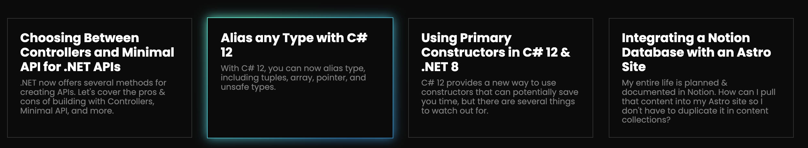

# BaldBeardedBuilder.com
The personal portfolio of Michael Jolley.

## What I Like

I found this screenshot on the Astro homepage.

There were a few things I really liked about it. First, was the gradient in his name: Michael. I like how the H1 text rests on space with svg dots behind it but not entirely around it.

I really like the floating shapes. It feels playful and trustworthy.

His image is great, and I like how his head breaks into the Hero above it.

The highlight in the H2 ("About Michael") is nice.

Good color selections.

Unfortunately, the site has changed since. I don't much enjoy the new design. Though there is one redeeming component:

### Recent Articles component

I think the text on his new site is difficult to read, and so it won't keep my attention long. But I did really enjoy this hover border/box-shadow he's put on his Recent Articles box component.

I definitely want to do something like that in the future. If I do, though, I might want to add something else that follows the cursor with a blurry background in the same color as the border/box-shadow. It would pop more.